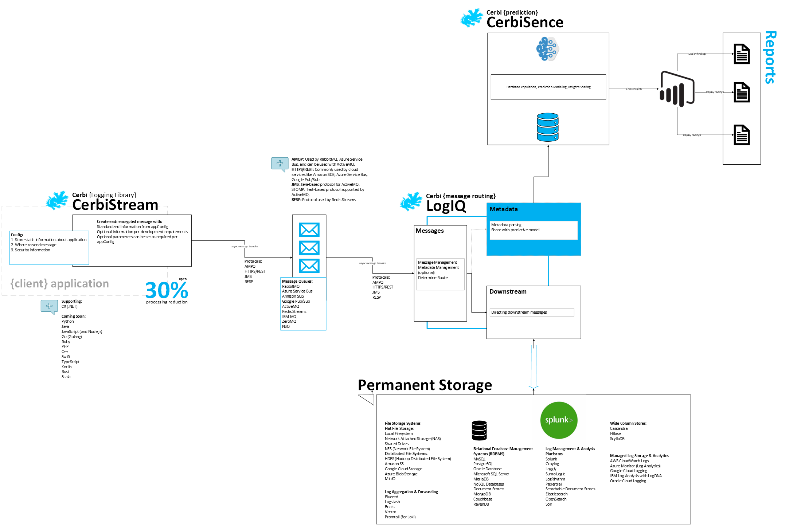

# Cerbi Logging Suite

Cerbi is a modern, scalable logging solution designed for distributed systems and cloud environments. It combines logging, message routing, and metadata-driven insights into a unified, developer-friendly platform. Cerbi helps organizations achieve consistent, resource-efficient logging with built-in support for Business Intelligence (BI) and predictive analytics.

---

## 🔑 Key Features

### **CerbiStream (Logging Library)**
- **Developer-Friendly API**: Simple integration with minimal setup.
- **Metadata Capture**: Automatically collects essential metadata (OS, framework, timestamp, cloud provider, region, etc.).
- **Protocol Support**: Compatible with AMQP, HTTPS, REST, and more.
- **Queue Systems**: Works with Azure Service Bus, RabbitMQ, Kafka, and others.

### **CerbiLogIQ (Routing Service)**
- **Dynamic Log Routing**: Distributes logs to appropriate destinations, including:
  - Relational and NoSQL databases
  - Data lakes (Azure Blob Storage, S3, etc.)
  - Log aggregators (Splunk, Loggly)
- **Metadata Parsing**: Enhances routing with intelligent metadata management.

### **CerbiSense (Analytics & Insights)**
- **BI and Reporting**: Integrated with tools like Power BI for visualization.
- **Predictive Analytics**: Enables anomaly detection and performance insights.
- **Customizable Metadata Pools**: Aggregates metadata across systems for better visibility.

---

## 🚀 Get Started

### Installation

The CerbiStream logging library is available on NuGet:

```bash
dotnet add package cerberus-logger-interface
```

Visit the [NuGet Package](https://www.nuget.org/packages/cerberus-logger-interface/) for details.

---

## 📖 Usage

### **Configuration**
Add the following to your `appsettings.json`:

```json
{
  "Logging": {
    "ApplicationName": "MyApp",
    "DestinationType": "Azure_Queue",
    "LogLevel": "Information",
    "ConnectionString": "your_connection_string",
    "QueueName": "myapp-logs",
    "CloudProvider": "Azure",
    "Encryption": {
      "IsEnabled": true,
      "Algorithm": "AES-256"
    },
    "HostType": "Cloud",
    "Region": "East US"
  }
}
```

### **Minimal Logging**
```csharp
await logger.SendApplicationLogAsync(
    applicationMessage: "An error occurred.",
    currentMethod: nameof(MyMethod),
    logLevel: LogLevel.Error,
    log: "Detailed log message",
    hostType: HostType.Cloud,
    timestamp: DateTime.UtcNow,
    encryption: new Encryption { IsEnabled = true, Algorithm = "AES-256" },
    operatingSystem: RuntimeInformation.OSDescription,
    frameworkVersion: RuntimeInformation.FrameworkDescription
);
```

### **Full Logging**
```csharp
await logger.SendApplicationLogAsync(
    applicationMessage: "Transaction completed.",
    currentMethod: nameof(MyMethod),
    logLevel: LogLevel.Information,
    log: "Transaction details",
    hostType: HostType.Cloud,
    timestamp: DateTime.UtcNow,
    encryption: new Encryption { IsEnabled = true, Algorithm = "AES-256" },
    operatingSystem: RuntimeInformation.OSDescription,
    frameworkVersion: RuntimeInformation.FrameworkDescription,
    applicationName: "MyApp",
    platform: "Web",
    applicationVersion: "1.0.0",
    cloudProvider: CloudProvider.Azure,
    region: new Region { RegionName: "East US", Country: "USA" },
    traceId: Guid.NewGuid().ToString(),
    destination: new TransactionDestination { Name = "Database", Type = "SQL" },
    destinationType: TransactionDestinationTypes.Database
);
```

---

## 🏗️ Architecture Overview

CerbiStream provides a seamless logging and routing experience. CerbiLogIQ ensures that logs are routed intelligently, while CerbiSense provides analytics and predictions.

### **Architecture Diagram**


1. **CerbiStream**: Captures and encrypts logs programmatically.
2. **CerbiLogIQ**: Manages and routes logs to downstream systems.
3. **CerbiSense**: Aggregates metadata for BI and predictive insights.

---

## 🛠️ Supported Platforms and Protocols

- **Languages**: C#, Java, Python, Go, Node.js, Ruby
- **Queue Systems**: RabbitMQ, Azure Service Bus, Kafka
- **Log Destinations**: SQL/NoSQL databases, Splunk, Loggly, and more
- **Protocols**: AMQP, HTTPS, REST

---

## 📝 License
Cerbi is licensed under the MIT License. See `LICENSE` for more information.
